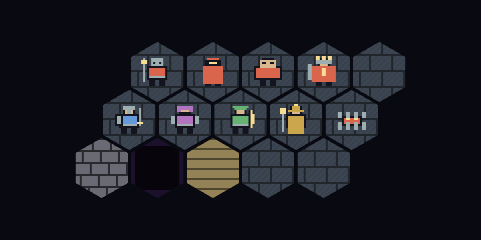

# Guild Tactics — рабочий прототип

Основа тактической RPG из `AGENTS.md`. Рабочее название и namespace не являются финальным названием игры.

## Запуск

WP-18/19: поле использует пиксельные текстуры склепа и отдельные силуэты четырёх классов
и пяти типов противников. Прогресс гильдии автоматически сохраняется между запусками.
Закрытие игры внутри участка возвращает к последней завершённой границе WP-30;
до первого завершённого участка — к гильдии перед отправлением. Тактический бой
не сохраняется. `New guild...` начинает новую гильдию после подтверждения.
Файл: `Application.persistentDataPath/guild-v1.json`, предыдущая корректная версия — `.bak`.
Ошибка записи или восстановление из копии показываются внизу экрана гильдии.
Обычный Play в редакторе также сохраняет прогресс; batch-проверки используют временные файлы.



1. Склонируйте репозиторий и добавьте полученную папку в Unity Hub как существующий проект:

   ```sh
   git clone https://github.com/demonYasudis/rpgbg3steam.git
   ```
2. Откройте её в **Unity 6000.2.8f1**.
3. Откройте `Assets/Scenes/TacticalPrototype.unity`.
4. Нажмите Play. Откроется гильдия: восемь героев, 100 золота, четыре выбранных участника.
   Кнопки `Remove` / `Select` меняют состав. Нажмите `Start crypt expedition`, чтобы открыть поле из 144 гексов.
5. Активный юнит выбирается автоматически по инициативе; состав врагов зависит от seed.
   Его клетка золотая, маркер крупнее; сверху показаны очередь, раунд и оставшиеся ресурсы.
6. Зелёные клетки показывают доступные назначения с учётом оставшихся очков движения.
   Нажмите ЛКМ на зелёную клетку: герой пройдёт по рассчитанному пути. Клетки других
   героев заняты и недоступны. Управлять другим героем можно только в его ход.
7. `End turn` завершает ход, даже если движение и действие не использованы.
   `Wait (skip action)` расходует одно действие без атаки. После обхода очереди начинается новый раунд.
8. Оранжевые противники появляются вдали от отряда; мини-босс отмечен красным.
   Нажмите ЛКМ на него в пределах дальности атаки (Warrior/Rogue: 1, Ranger: 4, Mage: 3): герой бросит d20 против защиты,
   а при попадании — кубик урона. Сначала исследуйте карту, чтобы найти врагов.
   Результат появится над противником; на время показа движение и завершение хода заблокированы.
   Под юнитами показано HP. Погибший противник исчезает и освобождает клетку.
9. `Combat Seed` в Inspector компонента Game Bootstrap задаёт случайность боя;
   seed также виден сверху и в Console. Повторный Play с тем же seed и действиями повторяет броски.

WP-01 добавляет логическую сетку 12×12: координаты, соседей, расстояния, типы местности и занятость.
WP-02 добавляет отображение поля, преобразование координат и выбор мышью.
WP-03 добавляет поиск кратчайшего пути по стоимости и подсветку диапазона движения.
WP-04 добавляет определения и runtime-состояние четырёх героев, выбор и анимированное перемещение.
WP-05 добавляет очередь ходов, расход движения, одно действие и блокировку ввода на время
анимаций. WP-06 добавляет кубики, ближние атаки, HP, смерть и всплывающие результаты.
WP-07 добавляет автоматические ходы врагов: подход, ближнюю атаку и завершение хода.
Во время хода врага команды игрока заблокированы. После гибели всех врагов отряд продолжает
ходить для сбора добычи и эвакуации. При гибели отряда появляется результат поражения.
Для нового боя перезапустите Play.
WP-08 добавляет по две способности каждому классу и панель действий:

- Warrior: Heavy Strike (+4 урона, −2 к попаданию), Push (на свободную клетку или в смертельную яму).
- Rogue: Backstab (+5 урона при союзнике рядом с целью), Evade (+4 защиты до следующего своего хода).
- Ranger: Aimed Shot (дальность 6, +3 к попаданию, +2 урона), Trap (8 урона первому наступившему врагу).
- Mage: Fire Burst (атака врагов в радиусе 1, без урона союзникам), Blink (телепорт на 3 клетки).

Выберите способность на панели и нажмите на допустимую цель; цели подсвечены фиолетовым.
Для Evade нажмите на свой гекс. `Move / cancel` возвращает обычное управление.
Каждая способность расходует единственное действие хода; перемещение остаётся отдельным.
Ловушка отмечена оранжевым, союзники проходят безопасно; новая ловушка заменяет предыдущую того же героя.
WP-09 добавляет стены (серые), ямы (тёмно-фиолетовые) и возвышенности (песочные).
Тип клетки указан при наведении. Стены и ямы непроходимы; Push в яму сразу убивает
цель и освобождает клетку. HighGround проходим без дополнительных бонусов.
WP-10 добавляет туман войны: чёрные клетки ещё неизвестны, затемнённые хранят увиденную
местность, открытые показывают текущих врагов. Обзор отряда — объединение радиусов
живых героев (по умолчанию 4 гекса). После движения, Blink, Push и смерти обзор обновляется.
Двигаться и выбирать цели можно только в текущем обзоре: подойдите к его краю,
чтобы открыть новые клетки. Fire Burst поражает только видимых врагов.
Стены перекрывают обзор и линию выстрела; враги используют те же правила в собственном радиусе обзора.
Кнопка `Vision debug` показывает состояния цветами: зелёный — Visible, синий — Explored,
чёрный — Unknown. Она не раскрывает врагов и не меняет правила действий.
WP-05–10 ожидают проверки в Unity; модельные проверки выполнены.

WP-11/12 заменяют фиксированное поле процедурной картой 12×12 и случайным составом врагов.
В Inspector у Game Bootstrap задайте `Dungeon Seed` (число или строка), `Dungeon Config`
и `Encounter Config`, затем запустите Play. Числовой seed отображается внизу экрана и в Console.
Одинаковые seed и настройки повторяют карту и состав врагов; `Combat Seed` независимо задаёт броски боя.
По умолчанию: 3–5 врагов, бюджет 10, шанс мини-босса 20% при достаточном бюджете.
Доступны Ash Crawler, Crypt Warden, Veil Stalker, Hollow Brute и мини-босс Cinder Keeper;
все используют ближний ИИ. Карта проверяет связность и при необходимости использует резервную раскладку.
Удалённая клетка цели используется для сундука WP-13; выход находится у входа в подземелье.
WP-11/12 ожидают Unity/Play Mode проверки; модельные проверки 200 seed выполнены.

WP-13 добавляет завершение экспедиции:

1. Найдите маркер `CHEST` в открытой области карты. Подведите активного героя на эту
   клетку или соседнюю и нажмите `Open chest` (расходуется одно действие).
2. Сундук выдаёт 20–60 золота, оружие или броню и лечебный расходник. Повторно забрать
   добычу нельзя. Награда зависит от Dungeon Seed, но не от бросков боя.
3. Победите всех противников. Ходы продолжаются: верните любого живого героя на `EXIT`
   у первой стартовой позиции и нажмите `Extract party`. Это эвакуирует всех выживших.
4. Экран результата покажет золото, предметы, HP и погибших. При поражении добыча теряется.

Предметы хранятся в гильдии как данные: экипировка и применение расходников ещё не реализованы.
Результат хранится только в текущей сессии Play.
Модельные проверки 50 экспедиций прошли; WP-13 ожидает Unity/Play Mode проверки.

WP-14/15 добавляют гильдию и последствия смерти:

- `Return to guild` переносит HP, погибших, золото и предметы ровно один раз.
  Можно изменить состав и начать вторую экспедицию без Stop/Play. Резервные герои имеют отдельные ID.
- Ранения сохраняются; `Heal (5)` полностью восстанавливает живого героя за 5 золота.
- На местах смерти героев показаны `BODY` или `LOST`, когда клетка видима.
  После победы успешная эвакуация автоматически возвращает тела на земле, связанной с выходом.
- Тела в ямах/отрезанных клетках потеряны; эвакуация требует `Confirm permanent loss`.
  При полном поражении все четыре героя потеряны, добыча не возвращается.
- `Resurrect (30)` восстанавливает героя с возвращённым телом за 30 золота.
  Потерянного героя выбрать или воскресить нельзя. Есть четыре резервных героя; найма пока нет.
- Если живых героев меньше четырёх и воскрешение недоступно, текущая гильдия не может
  отправить отряд. Stop/Play начинает новую гильдию. Сохранение на диск относится к WP-19.

В этом пакете повторные экспедиции используют прежний Dungeon Seed; выбор экспедиций и
смена seed относятся к WP-16, который не начат. WP-14/15 ожидают настоящей Unity/Play Mode проверки.

Проверка модели в редакторе: `Tools > Guild Tactics > Validate Hex Grid`.
Команда также открывает сохранённую сцену TacticalPrototype для проверки основы; сначала сохраните текущую сцену.
Проверка геометрии: `Tools > Guild Tactics > Validate Hex Layout`.
Проверка путей и стоимости: `Tools > Guild Tactics > Validate Hex Pathfinding`.
Проверка модели и перемещения героев: `Tools > Guild Tactics > Validate Unit Movement`.
Проверка очереди и состояний: `Tools > Guild Tactics > Validate Turns`.
Проверка бросков и боя: `Tools > Guild Tactics > Validate Basic Combat`.
Проверка ИИ и исхода боя: `Tools > Guild Tactics > Validate Melee Enemies`.
Проверка восьми способностей: `Tools > Guild Tactics > Validate Class Abilities`.
Проверка местности: `Tools > Guild Tactics > Validate Terrain`.
Проверка обзора: `Tools > Guild Tactics > Validate Visibility`.
Проверка генерации: `Tools > Guild Tactics > Validate Dungeon and Encounters`.
Проверка экспедиции: `Tools > Guild Tactics > Validate Expedition`.
Проверка гильдии и тел: `Tools > Guild Tactics > Validate Guild and Recovery`.

Подробности и ограничения: [Docs/TECHNICAL_NOTES.md](Docs/TECHNICAL_NOTES.md).

## Работа с разных устройств

Перед началом работы выполните `git pull` в папке проекта. После изменений сохраните сцену и файлы в Unity, затем выполните:

```sh
git add .
git commit -m "Describe changes"
git push
```

На каждом устройстве используйте Unity **6000.2.8f1**. Кеши Unity исключены из Git и создаются при открытии проекта. Файлы `.meta` нужно сохранять вместе с соответствующими ассетами.

Код и документацию можно редактировать в браузере через редактор GitHub, открыв страницу репозитория и нажав `.`. Для запуска игры и проверки сцен нужен установленный Unity Editor. После браузерных изменений выполните `git pull` на компьютере.

## WP-16/17 — выбор экспедиции и интерфейс

В гильдии выберите Outer crypt (2–3 противника, без мини-босса) или Deep crypt
(3–5 противников, возможен мини-босс). Награда обоих походов: 20–60 золота,
оружие либо броня и лечебный расходник. Каждый успешный запуск меняет seed;
неудачный запуск его не расходует. В рамках одной сессии доступен следующий поход
с текущими ранениями, составом и ресурсами гильдии.

Компактная панель показывает активного героя, раунд, ресурсы хода и цель экспедиции.
Наведите на характеристики/способность для подсказки. Золотой гекс — активный юнит,
зелёный — движение, фиолетовый — допустимая цель. Недопустимый клик объясняется
под панелью действий. Last combat result позволяет повторно прочитать последний бросок.
Return / retreat требует подтверждения: живые сохраняют ранения, добыча и тела теряются.
New guild... внизу гильдии создаёт новый состав после подтверждения.

Debug Mode в Inspector показывает seed и переключатель обзора; в этом режиме
Encounter Config из Inspector заменяет сложность выбранного похода. В обычной игре
действуют параметры выбранного похода, отладочные данные скрыты.

## Язык интерфейса / Interface language

Кнопки **RU / EN** в правом нижнем углу переключают язык сразу на всех экранах: гильдия, бой, подсказки и результаты экспедиции. При первом запуске выбран русский. Выбор сохраняется между запусками отдельно от прогресса гильдии. **EN** возвращает исходные английские тексты.

Use **RU / EN** in the bottom-right corner to switch all interface screens instantly. Russian is the first-launch default; the chosen language persists independently of guild saves. **EN** uses the original English text. Content IDs and save files are unchanged.

Проверка переводов: `Tools > Guild Tactics > Validate Interface Languages`. Batch: `-batchmode -nographics -quit -executeMethod GuildTactics.Editor.LocalizationChecks.RunBatch` (также проверяет способности, гильдию, выбор экспедиций и сохранения).

Equipment and consumables (WP-21/22): after finding loot, scroll down in the guild
screen to equip a hero with one weapon and armor and assign up to two healing
potions. The Potion action heals its owner by up to 8 HP and spends the turn's action.
Survivors keep remaining supplies; recovered bodies return equipment to storage;
lost heroes lose carried items. Save schema 2 automatically reads schema 1 saves.
Unity acceptance is pending; see Docs/TECHNICAL_NOTES.md and Docs/DEMO_V02_ROADMAP.md.

## WP-23 — Найм героев

В гильдии доступны четыре кандидата существующих классов по 20 золота.
Нанятый герой появляется в списке, после чего его можно выбрать в отряд и снарядить.
Кандидаты обновляются только после возвращения из завершённого похода (включая
отступление и поражение). Повторное открытие экрана и загрузка игры список не обновляют.
Найм, оставшиеся предложения и уникальные ID сохраняются; сохранения v1/v2 загружаются.
Если собрать четверых нельзя даже с наймом и воскрешением, экран предлагает начать
новую гильдию с подтверждением. Размер списка ограничен 256 героями, включая потерянных.
Проверка: `Tools > Guild Tactics > Validate Recruitment`.

## WP-24/25 — Развитие героев и стены

Выжившие участники получают 100 опыта за успешную эвакуацию и 25 за отступление.
Резервные и погибшие герои опыта не получают. Пороги уровней 2–5: 100, 250, 450,
700 общего опыта; опыт ограничен 700. За каждый уровень в гильдии можно выбрать
+1 к атаке либо +1 к защите. Эти бонусы складываются с экипировкой, сохраняются
после смерти и воскрешения. Нанятые герои начинают с уровня 1. Старые сохранения
v1–v3 загружаются с нулевым опытом; текущая схема — v4.

Стены видны, если перед ними нет другой стены, но скрывают клетки за собой.
Прямые атаки и Trap требуют свободной линии от действующего героя, даже если
другой герой видит цель. Fire Burst требует линии до центра и от центра до каждой
поражённой цели; невидимые враги не поражаются. Blink может пересекать стены, если
отряд сейчас видит свободную клетку назначения. Касание угла или грани стены
перекрывает линию; возвышенности, ямы и юниты обзор не перекрывают.

Проверки: `Tools > Guild Tactics > Validate Hero Progression` и
`Validate Wall Occlusion`. Общий Unity batch runner включает оба пакета.

## WP-26 — Стрелок склепа

В случайных встречах появился Стрелок склепа: 12 HP, дальность 4 гекса, обзор 6,
движение 3, стоимость 3 в бюджете встречи. Стрелок выбирает достижимую позицию
с прямой линией выстрела и по возможности выходит из соседства с героями, затем
атакует один раз. Если безопасный выстрел уже доступен, он сохраняет позицию.
Он не преследует невидимых героев; отсутствие пути или цели не задерживает ход.
Состав встречи по одному seed повторяется, но добавление архетипа изменяет
результаты генерации относительно прежней версии. Используется существующая
анимация лучника и отдельный пиксельный силуэт для режима резервной графики.
Проверка: `Tools > Guild Tactics > Validate Ranged Enemies`.

## WP-27 — Вспышка углей

Хранитель углей готовит удар по области радиусом один гекс вокруг видимого героя
в пределах четырёх гексов. Подготовка занимает действие босса. Красные клетки
обозначают фиксированную область: они не следуют за героем. На следующем ходе
босса живые герои, оставшиеся внутри, получают по 10 урона; союзники босса не
поражаются. Каждый живой герой получает свой ход между подготовкой и ударом.
Можно выйти из зоны или убить босса до исполнения.

Стены и ямы не входят в область; скрытые/исследованные клетки не подсвечиваются.
Невидимый босс не начинает подготовку, раскрывающую его присутствие. Смерть босса,
поражение, завершение экспедиции и уничтожение поля отменяют ожидающий удар.
Проверка: `Tools > Guild Tactics > Validate Boss Telegraph`.


## WP-28 — Three expedition missions (2026-10-07)

The guild offers Recover relic (Outer crypt, 20–40 gold), Clear area (Deep crypt,
40–70 gold) and Eliminate target (Marked quarry, 30–60 gold). Each also awards a
weapon or armor and a healing draught. Relic pickup costs one action; hunting
requires only the marked enemy; clearing requires every enemy and no relic.
Complete the objective and bring an active survivor to EXIT. Target markers obey
fog of war. Rewards and targets repeat for the same seed/config; return awards
rewards once. Dead heroes are recovered only on reachable ground after full
clearance; extraction with enemies remaining requires confirmation to abandon
bodies. Existing offer indices 0/1 and save schema 4 remain compatible; hunt uses
index 2. The older chest-and-clear rule remains only for legacy validation fixtures.

Validation: MissionChecks covers all three missions across 40 seeds with replay,
partial extraction, body loss confirmation and duplicate extraction rejection.
Shared Unity checks exercise actual offer switching and guild reward transfer.
Windows Development x64 build is verified separately. Manual visual acceptance
is still useful for the translated guild layout at different screen sizes.

## WP-29 — Досрочное отступление

Чтобы уйти без завершения задания, приведите активного живого героя на **EXIT**
и нажмите **Вернуться / отступить** (Return / retreat). Действие тратить не нужно.
Все выжившие уходят вместе, сохраняя HP, снаряжение и оставшиеся зелья; каждый
получает 25 опыта. Вся добыча и награда за задание теряются, даже если цель уже
выполнена. Для получения награды используйте успешную эвакуацию.

Тела возвращаются только после уничтожения всех врагов и только с клеток,
достижимых от выхода. Остальные погибшие и их снаряжение теряются навсегда.
Окно подтверждения перечисляет последствия для каждого героя; отмена ничего
не меняет. После возврата можно выбрать замену погибшим и начать новый поход.
Проверка: `Tools > Guild Tactics > Validate Early Retreat`.

## WP-30 — Поход из нескольких участков

Внешний склеп состоит из двух участков, глубокий склеп и охота — из трёх.
Каждый участок остаётся картой 12×12 с выбранным типом задания и своей наградой.
Выполните цель и доберитесь активным героем до ВЫХОДА: появится выбор вернуться
в гильдию с накопленной добычей или продолжить. После последнего участка доступно
только возвращение. Золото, предметы и опыт начисляются гильдии один раз в конце
похода; опыт за успешное возвращение — 100, за отступление — 25.

HP, экипировка, развитие и оставшиеся зелья выживших переходят дальше без лечения
и пополнения. Погибшие не появляются на следующей карте. Доступные тела после
полной зачистки переносятся с отрядом; остальные навсегда оставляются при
подтверждении выхода. Уже взятые тела сохраняются при успешном выходе или
отступлении с последующих участков. Полное поражение теряет всю накопленную
добычу, живых участников и переносимые тела. Отступление через ВЫХОД до завершения
текущего задания сохраняет награды предыдущих участков, но теряет добычу текущего.

После каждого завершённого участка автоматически сохраняется экран выбора.
Если закрыть игру на следующей карте, загрузка вернёт к этому экрану: действия,
потери и добыча незавершённой карты откатываются. Повторный вход воспроизводит
ту же карту, встречи и начальный поток бросков. До первой границы действует
прежнее восстановление гильдии перед отправлением. При ошибке записи продолжение
блокируется до повторного сохранения; можно вернуться в гильдию.

Схема сохранения v5 читает v1–v4. Проверка: `Tools > Guild Tactics > Validate
Multi-section Expeditions`; она также включена в общий Unity batch runner.


## WP-31 — События исследования

После успешного завершения каждого участка, включая последний, на экране границы
появляется одно событие: запечатанный тайник, кровавый алтарь, мутный источник или
проволочная ловушка. Выберите живого героя для исследования либо **Пройти мимо**.
Перед выбором показаны порог d20, награда, лечение и возможный урон. После выбора
видны бросок и фактические изменения HP/золота. Проход мимо ничего не расходует.
До выбора возвращение и продолжение заблокированы; проход мимо не требует броска.

Золото события добавляется к накопленной добыче и выдаётся один раз при возврате.
Ранения переходят на следующий участок и в гильдию. Погибшего на безопасной границе
героя выжившие забирают как тело; без последнего выжившего поход проигран, вся
добыча и переносимые тела теряются. Лечение не воскрешает погибших.

Выбор автоматически сохраняется вместе с границей (схема v6, читает v1–v5).
Загрузка показывает прежний результат и не применяет его снова; незавершённый
следующий участок откатывается с сохранением уже решённого события. Старые v5
границы загружаются без добавления события задним числом. При ошибке записи
доступно повторное сохранение; продолжение блокируется, пока запись не успешна.
Проверка: `Tools > Guild Tactics > Validate Exploration Events`.
